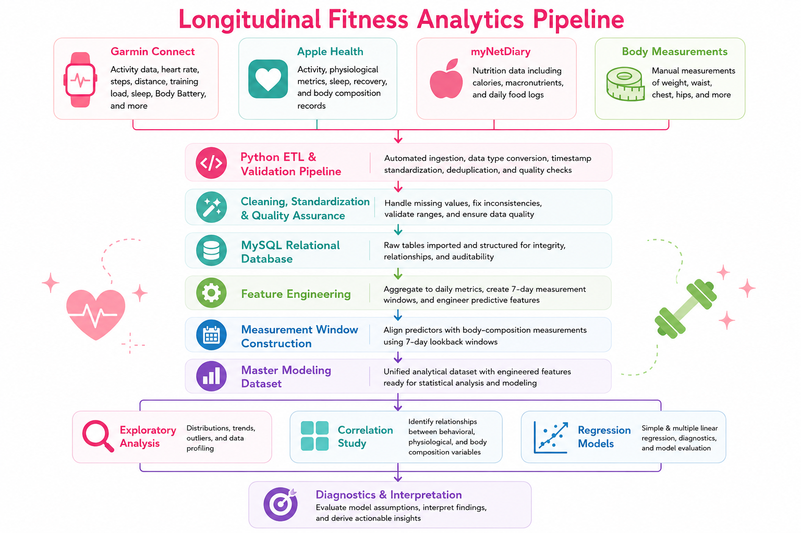
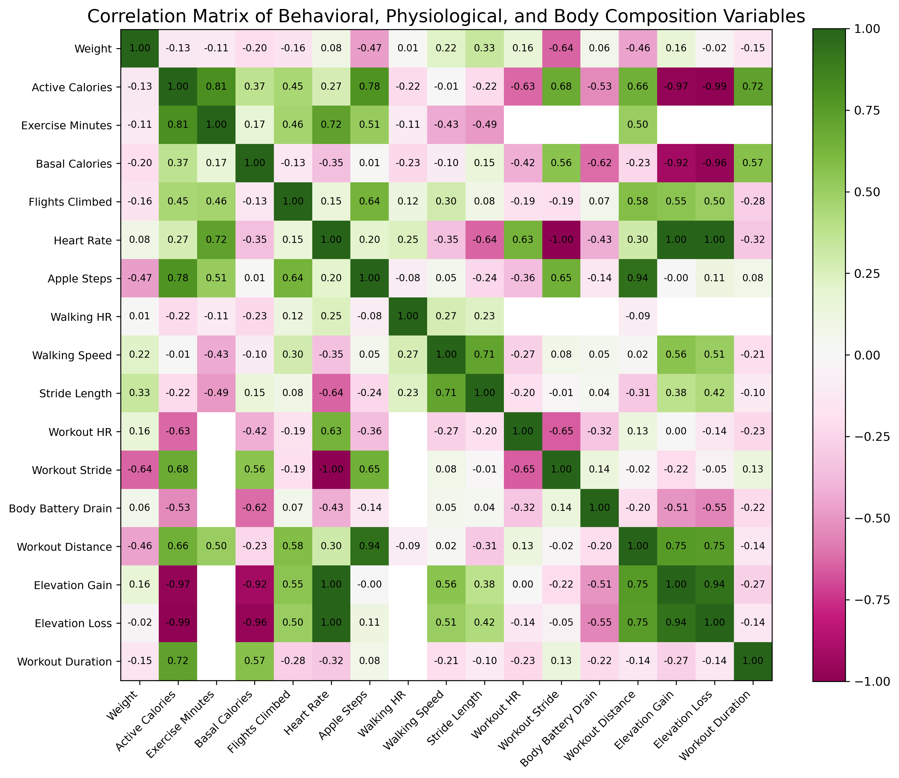
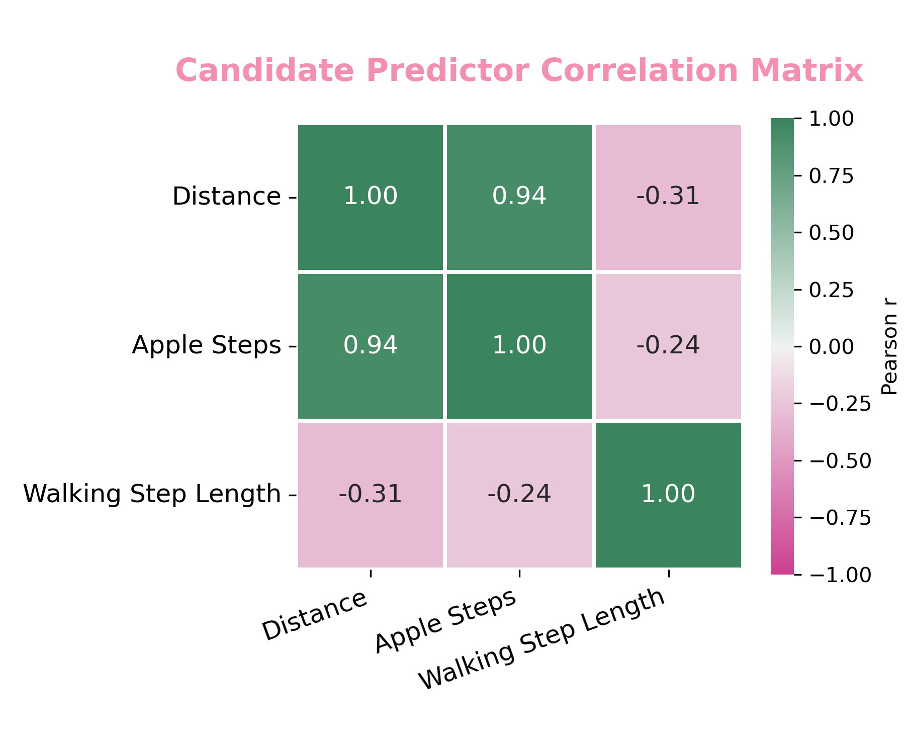
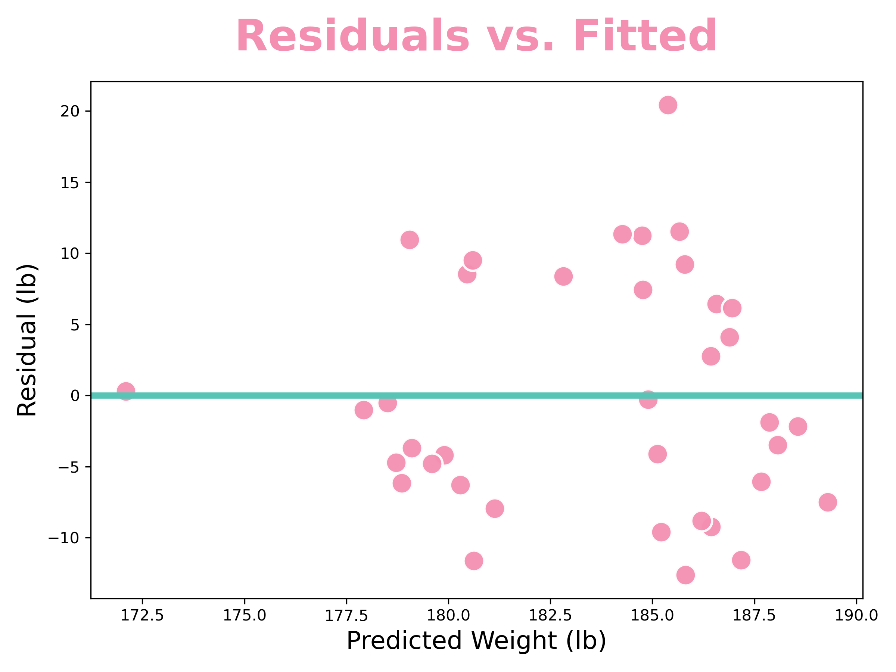
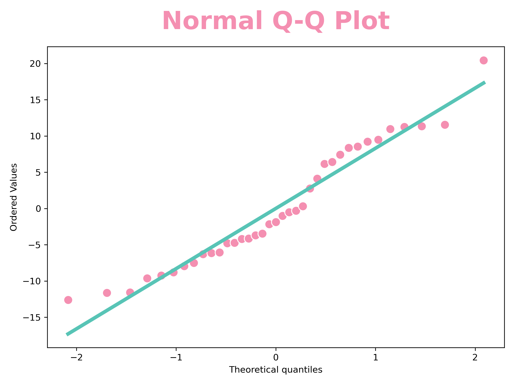

# Longitudinal Fitness Analytics

## Overview

The frustration of not seeing meaningful changes in my body composition led me to ask a simple question:

> _Why isn't my body composition changing?_

Although I had years of health and fitness data, the answer wasn't obvious. The information was scattered across multiple platforms, making it difficult to evaluate long-term trends or determine whether my training habits were producing measurable results.

Instead of relying on memory, intuition, or how I felt after a workout, I wanted evidence. I wanted to know whether the data actually supported the conclusions I was drawing about my own progress, and whether my reasoning could stand up to the data rather than assumptions.

Answering that question required building an end-to-end analytics pipeline that integrates four independent health data sources, cleans and validates heterogeneous datasets, engineers analytical features, and prepares both an auditable cleaned dataset (`df_clean`) and a modeling dataset (`df_model`) for statistical modeling.

The overall data pipeline follows the workflow below:



The resulting pipeline supports longitudinal analyses of body composition, training volume, strength progression, recovery metrics, and relationships between exercise behavior and physical outcomes.

---

## Skills Demonstrated

This project demonstrates:

- Python
- Pandas
- NumPy
- SQL (MySQL)
- Data Cleaning
- ETL Pipelines
- Data Integration
- Feature Engineering
- Exploratory Data Analysis (EDA)
- Statistical Analysis
- Pearson Correlation Analysis
- Linear Regression
- Regression Diagnostics
- Hypothesis Testing
- Data Visualization
- Longitudinal Data Analysis
- Reproducible Research
- Multiple Linear Regression
- Multicollinearity Assessment (VIF)
- Model Selection

---

## Research Questions

This project investigates questions including:

- Can weekly training volume predict changes in waist circumference?
- Which physiological and training metrics are most strongly associated with body composition?
- How do body measurements change over time relative to exercise behavior?
- Can historical activity data be transformed into measurement windows suitable for predictive modeling?
- How has strength progressed over time after accounting for changes in body weight?
- Which variables appear to have the strongest relationships with long-term fitness outcomes?

---

## Data Sources

The project combines data exported from four independent platforms:

- Garmin Connect
- Apple Health
- myNetDiary
- Manual body measurements

These datasets are imported into a relational MySQL database, validated and standardized through a combination of Python and SQL workflows, and ultimately merged into unified analytical datasets for downstream statistical modeling.

---

## Technologies

- Python
- Pandas
- NumPy
- Matplotlib
- MySQL
- Jupyter Notebook
- Garmin Connect
- Apple Health
- Git
- GitHub

---

## Repository Structure

```text
fitness-analytics/
├── notebooks/
├── data/
│   ├── raw/
│   ├── cleaned/
│   └── processed/
├── scripts/
├── src/
├── sql/
├── figures/
├── docs/
├── config/
└── README.md
```

---

## Installation

Clone the repository:

```bash
git clone https://github.com/ThatOneNebulaGirl/fitness-analytics.git
cd fitness-analytics
```

Required software

- Python 3.12+
- Jupyter Notebook
- MySQL 8+

---

## Usage

The project is designed as a reproducible analytics pipeline.

The recommended execution order is documented in:

```text
docs/run_order.md
```

The pipeline performs:

- Garmin activity data cleaning and validation
- Apple Health XML record discovery and extraction
- Construction of raw MySQL database tables
- SQL-based validation and standardization
- Data cleaning and datatype conversion
- Feature profiling and quality assessment
- Construction of auditable cleaned datasets (`df_clean`)
- Construction of modeling datasets (`df_model`)
- Feature engineering
- Dataset integration across multiple health platforms
- Statistical analysis
- Visualization generation

---

## Results

The completed pipeline produces reproducible analytical datasets supporting exploratory statistical analyses of longitudinal fitness behavior.

### Key Findings

- Integrated four independent health data sources into a unified analytical database.
- Expanded the historical analysis period to more than seven years.
- Processed and validated over 1.7 million health observations.
- Developed reproducible ETL, data-cleaning, and feature-engineering pipelines.
- Identified Distance as the strongest individual predictor of body weight among the variables evaluated.
- Developed and evaluated multiple linear regression models using engineered behavioral predictors.

To investigate the project's research questions, the following analytical methods were implemented:

- Relative strength progression adjusted for body weight.
- Longitudinal body-weight and body-composition trend analysis.
- Seven-day measurement-window feature engineering.
- Pearson correlation analysis across engineered behavioral and physiological features.
- Simple linear regression screening of engineered predictors.
- Multiple linear regression modeling using engineered behavioral predictors.
- Multicollinearity assessment using correlation analysis and Variance Inflation Factors (VIFs).
- Regression diagnostics, including residual analysis, normal Q–Q assessment, and actual-versus-predicted model evaluation.
- Identification of behavioral features most strongly associated with body weight.

The resulting analyses indicate that weekly Distance and Apple Step Count exhibited the strongest individual linear relationships with body weight. Because these variables were highly collinear, Apple Step Count was excluded from the final multiple regression model. The final model retained Distance and Walking Step Length, providing the best balance between predictor independence, sample size, and interpretability.

### Key Findings

- Integrated four independent health data sources.
- Expanded historical coverage to more than seven years.
- Processed more than 1.7 million health observations.
- Built reproducible ETL and feature-engineering pipelines.
- Distance exhibited the strongest individual relationship with body weight.
- Developed multiple linear regression models with full diagnostic evaluation.

## Selected Visualizations

The following figures summarize the primary analytical results of this project. Additional visualizations and statistical outputs are available in the accompanying Jupyter notebook.

### Correlation Analysis



The full correlation matrix was used during exploratory data analysis to identify potential relationships between behavioral, physiological, and body-composition variables. Average distance traveled exhibited one of the strongest negative correlations with body weight, making it a strong candidate for subsequent regression analysis. The matrix also revealed substantial correlations among several predictor variables, motivating additional multicollinearity assessment before model construction.

### Predictor Selection



Candidate predictors were evaluated for multicollinearity prior to multiple linear regression. Apple Step Count and Distance demonstrated a very strong positive correlation (Pearson _r_ = 0.94), indicating that both variables contained largely overlapping information. Distance was retained because it exhibited the stronger relationship with body weight, while Apple Step Count was removed to reduce multicollinearity and improve model interpretability.

### Regression Diagnostics

|                                  Residuals vs. Fitted                                  |                                Normal Q-Q Plot                                 |
| :------------------------------------------------------------------------------------: | :----------------------------------------------------------------------------: |
|  |  |

Diagnostic plots were used to evaluate the assumptions of the final multiple linear regression model. The residual plot showed no strong systematic pattern, supporting the assumption of linearity, while the Q-Q plot indicated that residuals were approximately normally distributed with only minor deviations at the extremes. Together, these diagnostics suggested that the final regression model provided a reasonable fit for the available longitudinal dataset.

Diagnostic plots were used to evaluate the assumptions of the final multiple linear regression model. The residual plot showed no strong systematic pattern, supporting the assumption of linearity, while the Q-Q plot indicated that residuals were approximately normally distributed with only minor deviations at the extremes. Together, these diagnostics suggested that the final regression model provided a reasonable fit for the available longitudinal dataset.

---

## Documentation

Additional documentation is located in the `docs/` directory.

- `run_order.md` — execution order for reproducing the project.
- Additional documentation describing the data pipeline and methodology.

---

## Future Improvements

- Automate Garmin Connect data extraction using Selenium.
- Schedule nightly ETL execution on a Raspberry Pi or another always-on system.
- Expand the database with exercise-specific strength metrics.
- Incorporate daily macronutrient intake into the analytical dataset.
- Continue increasing longitudinal data coverage to improve statistical power.
- Evaluate additional predictive modeling approaches as the dataset grows.
- Develop interactive dashboards for longitudinal health monitoring.

---
